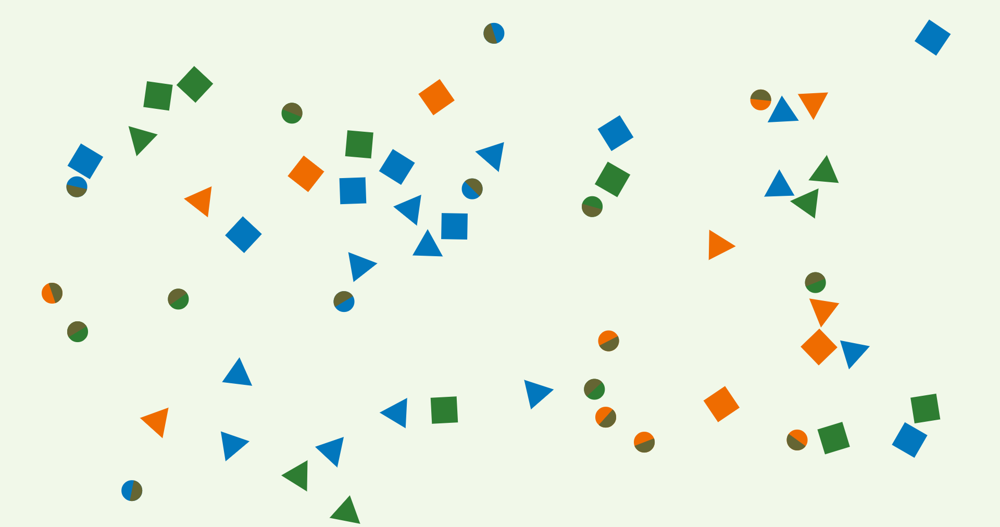

# Moving shapes (JavaScript)

There is a canvas that is stretched to entire screen and is filled with different figures: triangles, circles, recatngles.

Shapes are moving, rotating, bumping into each other, and changing angle of their movement and rotation.

Collisions are detected using SAT.

Look for reference:

[Separating Axis Theorem (SAT) Explanation](http://www.sevenson.com.au/actionscript/sat/)

[N Tutorial A - Collision Detection and Response ](http://www.metanetsoftware.com/technique/tutorialA.html)

[Collision Detection Using the Separating Axis Theorem](https://gamedevelopment.tutsplus.com/tutorials/collision-detection-using-the-separating-axis-theorem--gamedev-169)

[SAT (Separating Axis Theorem)](http://www.dyn4j.org/2010/01/sat/)

FULL OF BUGS:
- Collision detection is not very well maintained with circles.
- Sometimes shapes clutch together and drug each other.
- Sometimes shapes hustle through shapes that are not moving anywhere(static).

Disclaimer:
I'm not skilled in game programming at all and it's my first project of this kind. :)
